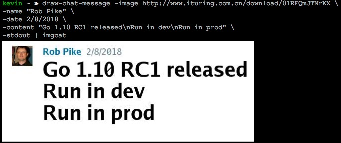

# draw-chat-message


What about draw a chat message like above picture use [Golang](https://golang.org/)?

It is inspired by this [article](https://egoist.moe/2017/09/15/draw-chat-message-with-canvas/), which uses canvas skills to draw a chat message

## Install

```bash
go get -u github.com/kr1sten0/draw-chat-message
```

## How to use?

```bash
draw-chat-message -image gopher.png -name Golang -content "Go\nGo\nGo"
```

Or use an internet image? OK!

```bash
draw-chat-message -image https://raw.githubusercontent.com/ashleymcnamara/gophers/master/GOPHER_SAFARI.png -name Golang -content "GOGOGO"
```

it will output a out.jpeg (you can use `-output` flag to define your custom file name) and open it with the OS default tool,
turn on `-open=false` flag if you don't want open the image. 

`draw-chat-message` is very versatile, it also can output to `stdout` instead of a file, you can use it with
imgcat and display image in iTerm2.

```bash
draw-chat-message -image gopher.png -name Golang -content "Hello world\nUse Golang" -stdout | imgcat
```



Not enough? other hundreds of configurable flags, please check `draw-chat-message -help`.